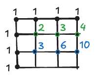

# Lattice Paths

Starting in the top left corner of a \\(20 \times 20\\) grid, and only being able to move to the right and down, 
there are exactly \\(6\\) routes to the bottom right corner.


How many such routes are there through a \\(20 \times 20\\) grid?

## Let's make it easier

When I saw this problem for the first time my first thought was that I probably can calculate it with a pen and paper.

But since we're coding in Scala here, let's try to make an application that will solve it for us.

\\(20 \times 20\\) is a big array, too big to reason about it, while the \\(2 \times 2\\) is a bit too small. Let's
then draw a \\(3 \times 3\\) one and mark the edges with dots. How many ways to we have to reach each of these dots?
Exactly one way. That was the easiest part.

<div style="max-width: fit-content; margin-inline: auto;">

</div>

Now let's try a second row. If we know how to get to the dot above and to the dot on the left side, then we also know
how to go to the dot in question, because from their positions there's just one way to continue (either left or down).

So, we can fill the second row starting from the left side. First dot will be \\(1 + 1 = 2\\), second will be
\\(3 + 1 = 3\\), third one will be \\(3 + 1 = 4\\)

<div style="max-width: fit-content; margin-inline: auto;">

</div>

The third row will be no different, let's continue the process:

<div style="max-width: fit-content; margin-inline: auto;">

</div>

And the same goes for the last one. The answer to a question in how many possible ways we can reach the last lattice
can be found in the bottom right corner: 20.

<div style="max-width: fit-content; margin-inline: auto;">

</div>

## Solution

The previous section shown us some properties of the lattice paths. We can now implement the algorithm that we used.
I went for a functional, recursive solution, but a mutable one that's based on a simple 2-dimensional `Array` could do as well. 

```scala
{{#include ../main/scala/Euler015.scala}}
```

It does exactly what we did manually, but on a larger scale. It fills the first row and first column with ones, and then
it calculates next elements from left to right, top to bottom. The answer is, as before, in the bottom right corner.
