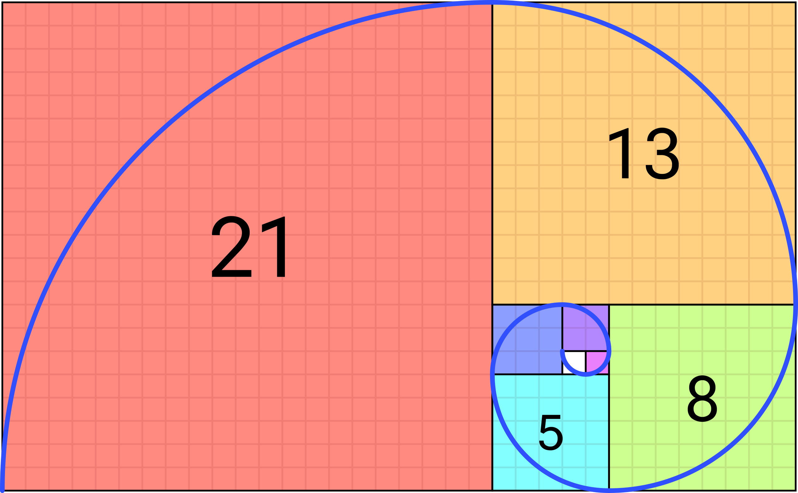

# 1000-digit Fibonacci Number

The Fibonacci sequence is defined by the recurrence relation:

\\(F_n = F_{n - 1} + F_{n - 2}\\), where \\(F_1 = 1\\) and \\(F_2 = 1\\)

Hence, the first 12 terms will be:

\begin{align}
F_1 &= 1\\\\
F_2 &= 1\\\\
F_3 &= 2\\\\
F_4 &= 3\\\\
F_5 &= 5\\\\
F_6 &= 8\\\\
F_7 &= 13\\\\
F_8 &= 21\\\\
F_9 &= 34\\\\
F_{10} &= 55\\\\
F_{11} &= 89\\\\
F_{12} &= 144
\end{align}

The \\(12th\\) term, \\(F_{12}\\), is the first term to contain three digits.

What is the index of the first term in the Fibonacci sequence to contain \\(1000\\) digits?

# Solution

This problem doesn't need any optimizations to be solved in milliseconds. It's perfectly fine to store 1000-digit
numbers within a `BigInt`, so we can just keep getting new Fibonacci sequence numbers until the result hits 1000 digits.

```scala
{{#include ../main/scala/Euler025.scala}}
```

# Pen and paper solution

We could stop there and call it a day, but this problem can be solved in a different way if we dive deep into one
curious property of the Fibonacci sequence.

## The golden ratio

There's an irrational number, called golden ratio and denoted with a Greek letter phi \\(\phi\\).
It's equal to \\(\frac{1 + \sqrt{5}}{2}\\), which is approximately \\(1.6180339887...\\)

It turns out, that once we divide Fibonacci sequence element with its previous element, we'll get closer to the
golden ratio as we go.

\begin{align}
13 ÷ 8 &= 1.625\\\\
21 ÷ 13 &= 1.61538462\\\\
34 ÷ 21 &= 1.61904762\\\\
...
\end{align}

It can be also represented graphically. I won't write too much about it. I'm not a mathematician, and I'm sure there
are places where this is explained much better.

<div style="max-width: fit-content; margin-inline: auto;">
    
    <div style="font-size: 1.2rem; text-align: center; color: #555; margin-top: 1px;">
        Image source: Wikipedia
    </div>
</div>

The most important information is, that for a very large number, we can use this formula to calculate the \\(nth\\)
element of the Fibonacci sequence.

\begin{align}
Fib(n) = round(\frac{\phi^n}{\sqrt{5}} ), where\\ \phi = (\frac{1 + \sqrt{5}}{2})
\end{align}

That's called progress! We are now free from calculating the previous elements of the Fibonacci sequence.

## Logarithm and the digits

We'll now use an interesting property of logarithms to find the number of digits of a very large number.

Logarithm of base 10, that is, \\(log_{10}(x)\\), lets us calculate to what power must 10 be raised to obtain the number
\\(x\\).

So, \\(log_{10}(100)\\) is \\(2\\), because \\(10^2 = 100\\).

What about \\(log_{10}(1000)\\)? It's \\(3\\), \\(10^3 = 1000\\).

We're off by one it seems. So... what about \\(log_{10}(999)\\)? It's \\(2,99956549\\), which is almost 3.

Using this property, we can tell how many digits a number has. We calculate the logarithm, floor the result,
and add one. Doing so for our first example, \\(log_{10}(100)\\), would return 3.

> [!TIP]
> Logarithms of base 10 are called common logarithms. From now on we'll denote them simply as "log"


In our case, we want to find a number that has 1000 digits. \\(10^{999}\\) is the first number that has \\(1000\\) digits,
so the number we're looking for should be equal or greater than that.

Combining everything mentioned before, we can describe our problem with this equation:

\begin{align}
log_{10}(\frac{\phi^n}{\sqrt{5}}) \geq 999\\\\
n log_{10}(\phi) - log_{10}(\sqrt{5}) \geq 999\\\\
n \geq \frac{999 + log_{10}(\sqrt{5})}{log_{10}(\phi)}
\end{align}

At this point we can just calculate these logarithms and substitute the values in our original equation:
\begin{align}
log_{10}(\sqrt{5}) \approx 0.349485\\\\
log_{10}(\phi) \approx 0.208988
\end{align}

After substituting:

\begin{align}
n \geq \frac{999 + 0.349485}{0.208988}\\\\
n \geq \frac{999.349485}{0.208988}\\\\
n \geq \frac{999.349485}{0.208988}\\\\
n \geq 4781.851039
\end{align}

We floor it and add 1, which gives us the result of **4782**.

